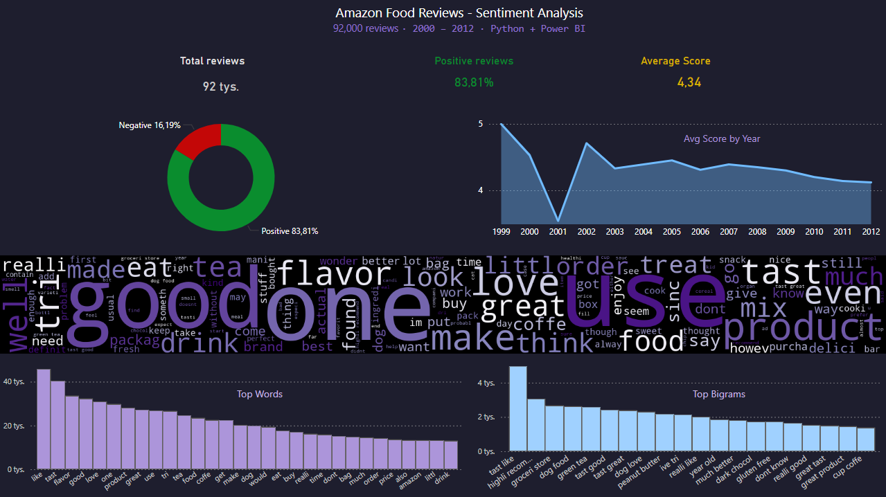

# 🔍 NLP Sentiment Analysis — Bag of Words

Analysis of Amazon customer reviews using the Bag of Words method to identify the most frequent topics and sentiment.

## 🔑 Key Findings
- **83.81%** of reviews are positive (4-5★)
- Most frequent words: *use, good, love, taste, product*
- Rating decline visible after 2001, stabilizing around 4.2★
- Negative reviews cluster around words: *return, waste, smell, disappointed*
- Polish reviews (`degustujemy.pl`) show similar sentiment patterns

## 🛠️ Tech Stack
- **Python** — pandas, nltk, scikit-learn, wordcloud
- **SQL** — SQLite
- **BI** — Power BI
- **API** — Kaggle API

## 📊 Results

### Bag of Words + TF-IDF + Logistic Regression

Binary sentiment classification (positive: 4-5★, negative: 1-2★). Neutral reviews (3★) excluded.

| Version | Accuracy | Recall (negative) | Macro F1 |
|---|---|---|---|
| Default | 0.92 | 0.61 | 0.83 |
| `class_weight='balanced'` | 0.89 | 0.87 | 0.83 |

**Chosen: `class_weight='balanced'`** — better detection of negative reviews at the cost of slightly lower overall accuracy. Class imbalance present: ~84% positive vs ~16% negative reviews.

## 🚀 How to run
1. Clone the repo: `git clone https://github.com/millka89/nlp-bow-sentiment-analysis.git`
2. Install dependencies: `pip install -r requirements.txt`
3. Add `.env` file with Kaggle token
4. Run scripts in order: `01` → `02` → ... → `10`
5. All processed files will be generated in `data/processed/`

## 📁 Project structure
"""
nlp-bow-sentiment-analysis/
│
├── .env ← Kaggle token (private, in .gitignore!)
├── .gitignore
├── README.md
├── requirements.txt
│
├── images/
│ └── dashboard_screenshot.png
│
├── data/ ← in .gitignore (files too large)
│ ├── raw/
│ │ ├── Reviews.csv ← Kaggle dataset
│ │ └── degustujemy_translated.csv ← scraped + translated
│ └── processed/
│ ├── reviews.db ← SQLite database
│ └── pb_*.csv ← Power BI exports
│
├── src/
│ ├── 01_download.py ← Kaggle API download
│ ├── 02_scrape_bs4.py ← web scraping (BeautifulSoup)
│ ├── 03_translate.py ← Polish → English translation
│ ├── 04_sql.py ← SQLite analysis
│ ├── 05_preprocessing.py ← tokenization, stopwords, stemming
│ ├── 06_bow_model.py ← TF-IDF + Logistic Regression
│ ├── 07_word_analysis.py ← top words, bigrams, wordcloud
│ ├── 08_sentiment_words.py ← positive vs negative word analysis
│ ├── 09_time_trends.py ← word and rating trends over time
│ └── 10_export_for_powerbi.py ← CSV export for Power BI
│
└── notebooks/
└── 00_exploration.ipynb
"""

## 📂 Data sources
- `data/raw/Reviews.csv` — [Kaggle: Amazon Fine Food Reviews](https://www.kaggle.com/datasets/snap/amazon-fine-food-reviews)
- `data/raw/degustujemy_scraped.csv` — generated by `src/02_scrape_bs4.py`

## 🌍 Note on multilingual data
The second data source (`degustujemy.pl`) contains Polish-language food reviews.
This is intentional — it demonstrates handling of non-ASCII characters
and multilingual NLP pipelines.